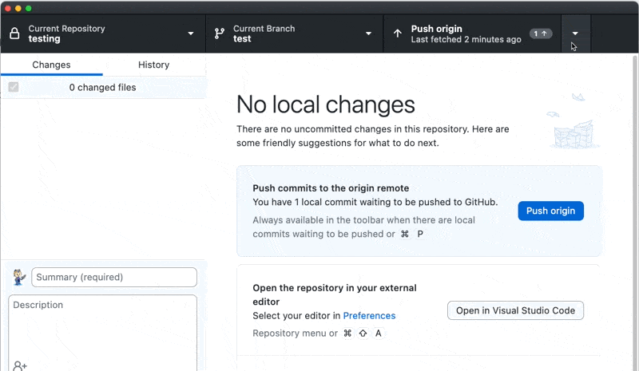
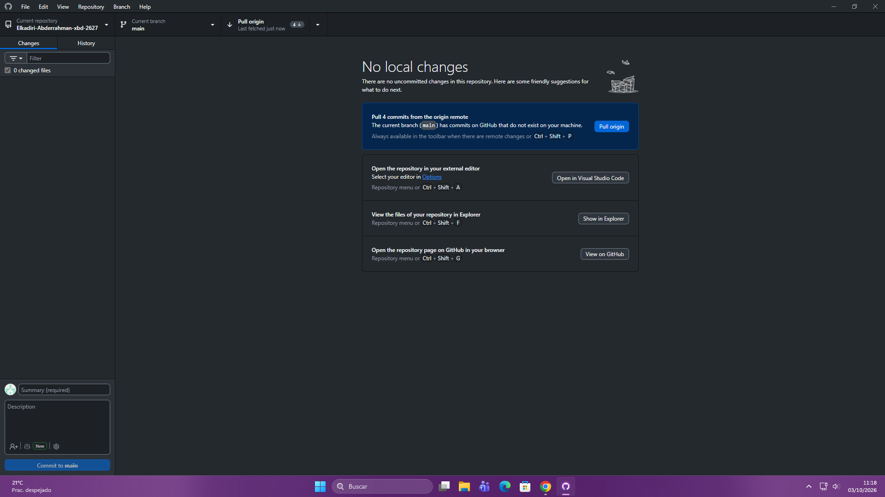

<!-- omit in toc -->
# Gestion de bases de datos

## Abderrahman el kadiri

### UNIDAD: 1

### NOMBRE-PRÁCTICA: INFORME-GUÍA USO E INSTALACIÓN DE GIT, GITHUB Y GITHUB-DESKTOP

### FECHA: 8/octubre/2026

- [Instalación de Git](#instalación-de-git)
- [2 : GITHUB- CREACIÓN DE CUENTA:](#2--github--creación-de-cuenta)
- [3 : GITHUB DESKTOP](#3--github-desktop)
- [4 Pasos para usar github](#4-pasos-para-usar-github)
    - [4.1 Push](#41-push)
    - [4.2 Pull](#42-pull)
- [Bibliografía](#bibliografía)
  

# Instalación de Git

 1 Instalamos Git x64 para windows, a la hora de instalar nos saldrá una ventana donde debemos seleccionar la opción que ponga "Nova"

# 2 : GITHUB- CREACIÓN DE CUENTA:

 Accedemos a la web de github, sino tenemos una cuenta nos registraremos y creamos una cuenta y un repositorio: 

Una vez hecho esto ya tendremos la carpeta del repositorio en nuestro equipos, tanto el particular como el del aula

 # 4 Pasos para usar github

 ### 4.1 Push

  Una vez añadido el archivo en nuestro dispositivo ejecutaremos el comando fetch, antes de subirlo a github debemos añadir un mensaje corto, y conciso. Finalmente ejecutamos el comando **"push"** para subirlo a la nube.

### 4.2 Pull

Si de lo contrario buscamos descargar nuestros archivos guardados en la nube a nuestro equipo, github desktop nos lo notifará y ejecutaremos el comando **"pull"**

# Bibliografía

-(https://git-scm.com/)

-(https://github.com/)

-(https://desktop.github.com/download/)

